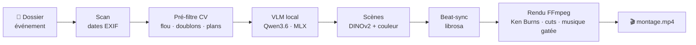

<div align="center">

<br/>

# 🎞️ Ricordu

### Vos souvenirs méritent mieux qu'un dossier oublié.
**Pointez un dossier de photos et vidéos. Récupérez un film-souvenir narratif, monté en rythme sur la musique. En un clic. 100 % sur votre Mac.**

*Your memories, cut into a film. Point at a folder, get a beat-synced memory movie — fully on-device, nothing uploaded.*

<br/>

[](https://github.com/ml-explore/mlx)
[](#)
[](#-100--local--privé)
[](#-100--local--privé)

[](https://huggingface.co/mlx-community/Qwen3.6-35B-A3B-4bit)
[](https://github.com/facebookresearch/dinov2)
[](https://librosa.org)
[](https://ffmpeg.org)
[](#)
[](LICENSE)

**[✨ La promesse](#-la-promesse) · [🤖 Les modèles](#-les-modèles-ia-tout-en-local) · [🚀 Installer](#-démarrage-rapide) · [🔜 À venir](#-à-venir) · [💬 Contact](#-me-contacter)**

<sub>📣 **Ricordu** se prononce **« ri-COR-dou »** — *le souvenir*, en corse. Exactement ce que fabrique le logiciel.</sub>

<br/>


<sub>*(capture de l'interface à ajouter — `docs/screenshot-ui.png`)*</sub>

</div>

---

## ✨ La promesse

> **Un dossier qui dort → un film qu'on regarde en famille. Sans rien envoyer en ligne.**

- 🪄 **Un clic, un film.** Pas de timeline, pas de glisser-déposer. Vous choisissez un dossier, l'IA fait le tri et le montage.
- 🧠 **Une IA qui *comprend* vos images** (pas un simple diaporama) : elle note la netteté, la composition, les visages, le « moment ».
- 🎬 **Beau comme un pro :** coupes calées sur le tempo, Ken Burns sans couper les visages, carton-titre, carton de fin, audio façon *Casey Neistat*.
- ♻️ **Analysé une fois, retouché à l'infini :** changez le rythme, la musique, la sélection — **sans tout réanalyser**.
- ⏱️ **La durée se cale sur la musique :** plus de boucle audible, le montage respecte la longueur de vos pistes.
- 🔒 **100 % privé :** vos enfants, votre famille ne quittent **jamais** votre Mac.

---

## 🏝️ Pourquoi « Ricordu » ?

*Ricordu*, c'est **« le souvenir » en corse**. Un nom choisi pour ce qu'il porte.

En **Corse**, la mémoire est une affaire de transmission. On se réunit le soir à la *veghja*, la veillée, pour raconter, chanter les *paghjelle* et garder vivante l'histoire de la famille et du village. Rien ne part sur un serveur : tout se transmet de vive voix, **au coin du feu, à la maison**.

C'est tout l'esprit de ce logiciel — faire de vos images un récit qu'on partage, qui reste chez vous, à vous. Comme le dit l'île : *u ricordu ùn si vende* — **le souvenir ne se vend pas.**

---

## 🎬 Le besoin

Nos pellicules débordent de **milliers de photos et vidéos jamais montées**. Le film qui les ferait revivre, on ne le fait jamais — c'est trop long. Et les outils qui le feraient pour nous (Google Photos, Apple, CapCut) envoient nos souvenirs les plus intimes sur leurs serveurs.

**Ricordu** fait ce film à votre place, **et il ne quitte jamais votre Mac.**

### 🆚 Ricordu vs les outils cloud

| | ☁️ Google Photos / CapCut | 🎞️ **Ricordu** |
|---|---|---|
| Vos images partent en ligne | ❌ Oui | ✅ **Jamais** |
| Fonctionne hors-ligne | ❌ Non | ✅ **Oui** |
| IA qui voit et note vos plans | ⚠️ Sur leurs serveurs | ✅ **En local (MLX)** |
| Montage rythmé sur la musique | ⚠️ Basique | ✅ **Beat-sync image par image** |
| Vous gardez la main (rythme, sélection, musique) | ❌ Boîte noire | ✅ **Tout est réglable** |
| Prix | 💸 Abonnement | ✅ **Gratuit & open-source** |

---

## 🤖 Les modèles IA (tout en local)

Aucune API, aucun serveur. **Tous ces modèles tournent sur le GPU et le Neural Engine de votre Mac, via [Apple MLX](https://github.com/ml-explore/mlx).**

| Modèle | Ce qu'il fait | Où il tourne |
|---|---|---|
| 🧠 **[Qwen3.6-35B-A3B](https://huggingface.co/mlx-community/Qwen3.6-35B-A3B-4bit)** · 4-bit MLX (MoE, ~3 B actifs) | Le *VLM* qui **regarde chaque photo**, la note (netteté, composition, visages, moment, beauté) et la légende en français | GPU Apple · **MLX** |
| 🎨 **[DINOv2 ViT-S/14](https://github.com/facebookresearch/dinov2)** · ONNX (384-d) | **Reconnaît les scènes identiques** par ressemblance visuelle et colorimétrie → regroupement cohérent | Neural Engine · **CoreML** |
| 🥁 **[librosa](https://librosa.org)** beat-tracker | Détecte le **tempo et les temps** → chaque coupe tombe sur un beat | CPU |
| 🎚️ **[PySceneDetect](https://www.scenedetect.com) · OpenCV · imagehash** | Découpe les vidéos en plans, rejette le flou, déduplique les rafales, suit le mouvement (flux optique) | CPU |
| 🖌️ **FFmpeg 8.1 · Pillow** | Rendu final : Ken Burns, transitions, *gating* musical, titres en overlay | GPU/CPU |

> 💡 Le tout sur un **Mac Apple Silicon (M1→M5)** — testé sur M5 Pro, ~91 tokens/s, pic ~21 Go de RAM.

---

## 🧠 Comment ça marche



---

## ⭐ Fonctionnalités

- 🧠 **Sélection des meilleurs plans par un VLM local** : note 0–10 + légende française.
- 🥁 **Beat-sync** : chaque coupe tombe sur un temps, en cuts francs façon Neistat.
- 🔇 **Audio « Neistat »** : la musique se coupe (ou se baisse) pendant les clips vidéo sonores — on entend le son réel — puis revient.
- ⏱️ **Durée calée sur la musique** : chaque piste affiche sa durée, et un budget en direct prévient si le montage dépasse la musique (ajustement en un clic).
- 🖼️ **Ken Burns sans couper les visages** : zoom centré et anti-tremblement ; portraits posés en entier sur fond flou.
- 🎨 **Regroupement de scènes** (DINOv2 + couleur + temps) pour une vraie cohérence visuelle.
- ❤️ **Mode RÉCIT** : accélère vers le moment fort (gâteau, bougies), le tient, puis relâche.
- ✂️ **Découpe vidéo intelligente** pilotée par l'audio (rires, applaudissements) et le mouvement.
- 🅰️ **Carton-titre et carton de fin éditables** (texte + photo).
- 🌐 **Interface web locale** : choix du dossier, progression temps réel, 3 rapports détaillés.
- 🎵 **Bibliothèque musicale** CC-BY avec suggestion selon l'événement ; mode *Module* (musique par section).
- 🖊️ **Éditeur de sélection** : inclure/exclure, découper un extrait, **re-rendu sans re-analyse**.
- 💾 **Projets sauvegardés** : enregistrer, recharger, supprimer avec tous les réglages.

---

## 🔒 100 % local & privé

- ✅ **Aucune image ni vidéo n'est uploadée.** Tout se passe sur le Mac.
- ✅ C'est un **VLM local** qui regarde les pixels — **aucun cloud, aucune API distante**.
- ✅ Le **seul** accès réseau est le **téléchargement initial** du modèle. Ensuite, plus rien (`HF_HUB_OFFLINE=1`).
- ✅ L'interface n'écoute que sur **`127.0.0.1`** — inaccessible depuis le réseau.
- ✅ Ni image, ni score, ni légende ne sortent de la machine. **Vos souvenirs restent à vous.**

---

## 🚀 Démarrage rapide

**Prérequis** : Mac **Apple Silicon** (M1→M5), macOS récent, [Homebrew](https://brew.sh), Python 3.12.

```bash
# 1. FFmpeg + Python
brew install ffmpeg python@3.12

# 2. Cloner et installer
git clone https://github.com/commeass/ricordu.git
cd ricordu
python3.12 -m venv .venv && source .venv/bin/activate
pip install mlx-vlm opencv-python imagehash scenedetect pillow-heif \
            librosa Pillow numpy onnxruntime scikit-learn scipy \
            huggingface_hub fastapi uvicorn

# 3. Télécharger le modèle VLM (~20 Go) dans un cache partagé
export HF_HOME="$HOME/Models"
huggingface-cli download mlx-community/Qwen3.6-35B-A3B-4bit
```

> ⚠️ Prenez bien la version **MLX** (pas le `.gguf`, incompatible avec `mlx-vlm`).

**Lancer l'interface :**

```bash
export HF_HOME="$HOME/Models"
./ui.sh          # ou : .venv/bin/uvicorn app:app --host 127.0.0.1 --port 8723
```

Puis ouvrez **http://127.0.0.1:8723** 🎉

---

## 🎛️ Utilisation

**Interface web** — choisir un dossier → régler (durée, rythme, ordre, musique) → **Créer le montage** → éditer la sélection → **Relancer** (re-rendu sans re-analyse).

**En ligne de commande :**

```bash
export HF_HOME="$HOME/Models" && source .venv/bin/activate
python diaporama.py scan "~/Pictures/Mon événement" -o storyboard.json
python diaporama.py ai_select storyboard.json --target 150 --order chrono
python diaporama.py render storyboard.json -o montage.mp4 --music music/Carefree.mp3
```

| Réglage | Options |
|---|---|
| **Rythme** | Doux · Punchy · Chaque beat · Dynamique · Module · **Récit** |
| **Ordre** | Chronologique · Par scène (DINOv2) · Highlights · Narratif |
| **Son sous la vidéo** | Couper la musique · La baisser (duck) |
| **Durée** | Calée sur la musique (budget en direct) |

---

## 🔜 À venir

Ricordu est en développement actif. Au programme :

- [ ] 📱 **Export vertical 9:16** pour les stories Instagram / TikTok
- [ ] 🎞️ **Presets cinéma** (grain, LUT, transitions supplémentaires)
- [ ] 🗣️ **Voix off / musique générée** en local
- [ ] 🔁 **Détection de doublons inter-événements**
- [ ] 📝 **Chapitres et sous-titres** automatiques (optionnels)
- [ ] 📦 **Application `.app`** en un clic, sans terminal
- [ ] 🌍 **Windows / Linux** (CUDA / ROCm) après la version Apple Silicon

⭐ *Mettez une étoile au repo pour suivre les sorties !*

---

## 💬 Me contacter

Une idée, un bug, une envie de collaborer ? **Tout se passe sur GitHub :**

- 🐛 **Bugs & idées** — [ouvrir une issue](https://github.com/commeass/ricordu/issues)
- 💡 **Questions & échanges** — [onglet Discussions](https://github.com/commeass/ricordu/discussions)
- ⭐ **Suivre le projet** — [mettez une étoile au repo](https://github.com/commeass/ricordu)

*Les retours sur vos souvenirs montés avec Ricordu sont les bienvenus.*

---

## 🤝 Contribuer

Les *issues* et *pull requests* sont bienvenues. Principe directeur non négociable : **rien ne doit quitter la machine de l'utilisateur.**

## 📜 Licence

[MIT](LICENSE) © 2026 — utilisez, modifiez, partagez.

## 🙏 Crédits

- 🎵 **Musique** — [Kevin MacLeod](https://incompetech.com), licence **CC BY 4.0** (attribution requise, voir `music/CREDITS.txt`).
- 🧠 **VLM** — [Qwen](https://github.com/QwenLM) (Alibaba), packagé par [mlx-community](https://huggingface.co/mlx-community).
- 🎨 **Scènes** — [DINOv2](https://github.com/facebookresearch/dinov2) (Meta AI).
- ⚡ **On-device** — [Apple MLX](https://github.com/ml-explore/mlx).

---

<div align="center">
<sub>

**Ricordu** — montage vidéo souvenir automatique local · alternative locale à Google Photos · monter ses photos en vidéo IA · film souvenir IA Mac Apple Silicon · diaporama privé sans cloud · beat-sync<br/>
*local AI photo montage · on-device memories video maker · private slideshow maker · no-cloud video editor for Apple Silicon*

🎞️ **Fait avec MLX, sur un Mac, sans cloud.** · ⭐ *Star le repo si l'idée vous plaît*

</sub>
</div>
